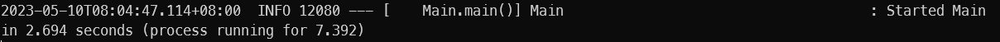

# 实验5 数据库程序设计

章越 3210103722

## 实验目的

1. 设计并实现一个精简的图书管理程序，要求具有图书入库、查询、借书、还书、借书证管理等功能。
2.  掌握数据库应用开发程序设计方法。

## 实验需求

### 数据需求

| name   | class  | attributes                                                   |
| ------ | ------ | ------------------------------------------------------------ |
| book   | Book   | book_id, category, title, press, publish_year, author, price, stock |
| card   | Card   | card_id, name, department, type                              |
| borrow | Borrow | card_id, book_id, borrow_time, return_time                   |

### 功能需求

1. 图书入库：向图书库中注册(添加)一本新书，并返回新书的书号。
2. 图书改变库存：为图书库中的某一本书改变库存。
3. 图书批量入库： 批量添加新书，若有一本书失败则回滚整个事务。
4. 图书删除： 从图书库中删除一本书，若有人借走该书尚未归还则删除失败。
5. 图书修改： 修改已经存在的图书的基本信息（书号和库存除外）。
6. 图书查询：根据提供的条件查询图书，并按指定方式排序，查询条件包括：类别点查(精确查询)，书名点查(模糊查询)，出版社点查(模糊查询)，年份范围查，作者点查(模糊查询)，价格范围查。
7. 借书：根据指定的书号、卡号、借书时间添加借书记录，若该卡借过此书且未归还则失败。
8. 还书：根据指定的书号、卡号查询借书记录并添加归还时间，归还时间不能早于借书时间。
9. 借书记录查询：根据卡号查询该卡所有借书记录，按照借书时间递减、书号递增的方式排序。
10. 借书卡注册：根据<姓名，单位，身份>注册借书卡，若已存在则不注册。
11. 借书卡注销：根据借书卡号注销该卡，若该卡有未归还的图书则不注销。
12. 借书卡查询：返回所有的借书卡。

## 实验环境

Java version 17.0.7

Apache Maven 3.9.1

MySQL Server 8.0.33

开发环境：VSCode + Java + Maven

## 系统各模块的设计思路和实现

### 高并发场景

在各模块中更新前需要先使用```SELECT```语句在数据库中查找时，使用```FOR UPDATE```添加排它锁，防止高并发场景下在```SELECT```和```UPDATE```之间数据库中数据被其它线程改变。

### 防止SQL注入

在各模块需要生成SQL语句时，不采用字符串拼接这样的高风险操作，而采用PreparedStatement语句，通过设定参数来实现SQL语句的拼接，避免了SQL注入风险。

### 图书入库

首先根据输入的图书类型、标题、出版社、出版年份和作者信息查找是否存在相同的图书，当找到一本图书的五项属性全部相同时认为图书已存在，抛出异常；

若该书不存在则尝试插入至数据库并获取数据库自动生成的book_id，获取失败则抛出异常并回滚事务；

若正常插入并获取到book_id则将book_id插入至输入的Book对象中并提交事务。

### 图书改变库存

首先根据输入的book_id查找该图书，若图书不存在或库存加上输入的改变量后为负数则抛出异常；

然后使用```UPDATE```语句更新数据库，提交事务。

### 图书批量入库

整体思路与图书入库模块相似，使用循环查找每一本图书是否存在于数据库中，若一本存在则直接抛出异常；

然后再次使用循环尝试插入每一本图书，完成后再尝试获取每一本图书的book_id，若其中任何一步失败则抛出异常回滚整个事务；

所有图书插入成功并获取到全部的book_id之后提交事务。

本模块中，使用addBatch()和executeBatch()函数来批量处理插入语句。

### 图书删除

首先根据输入的book_id查找是否存在该书尚未归还的借阅记录，若有则抛出异常；

然后尝试使用```DELETE```语句删除该图书，并获取该语句影响的数据库行数，若行数为零则表示该书不存在，因此抛出异常回滚事务；

成功删除之后提交事务。

### 图书修改

使用```UPDATE```命令更新输入的图书信息，更新时忽略图书的stock属性，避免对stock进行修改；

```sql
UPDATE book SET category = ?, title = ?, press = ?, publish_year = ?, author = ?, price = ? WHERE book_id = ?
```


更新成功后提交事务。

### 图书查询

由于查询条件可能为空，因此需要对SQL语句做一些处理：

```sql
SELECT * FROM book WHERE (category = ? OR ? IS NULL) AND (title like ? OR ? IS NULL) AND (press like ? OR ? IS NULL) AND (publish_year >= ? OR ? IS NULL) AND (publish_year <= ? OR ? IS NULL) AND (author like ? OR ? IS NULL) AND (price >= ? OR ? IS NULL) AND (price <= ? OR ? IS NULL)
```

之后根据输入的排序属性，在SQL语句最后增加```ORDER```命令。注意到此处如果用户输入的排序关键字不是book_id的话，还需要最后根据book_id升序排列（题目要求）。

再将输入的查询条件填充SQL语句，注意此处由于部分字符串需要模糊匹配，因此需要在字符串前后加上```%```，以Title属性为例：

```sql
 pstmt.setString(3, '%' + conditions.getTitle() + '%');
```

SQL语句填充完成后，执行查询语句，并将返回值逐一插入至Book列表，最后根据该列表构造BookQueryResults对象返回。

### 借书

首先根据输入的借阅信息查询该书的信息，若书不存在或库存不足则抛出异常；

其次查询是否存在该卡借阅该书且未归还的借阅信息，若存在则抛出异常；

向数据库中插入新的借阅记录，并将该图书的库存减一。

### 还书

首先根据输入的借阅信息查询是否存在该卡借阅该书且未归还的借阅记录

```sql
SELECT * FROM borrow WHERE card_id = ? AND book_id = ? AND return_time = 0 FOR UPDATE
```

若不存在该借阅记录则抛出异常；

若输入的归还时间早于查询到的借阅时间则抛出异常；

更新数据库中借阅记录，加上归还时间；再更新该图书的库存数据，库存加一。

### 借书记录查询

根据输入的card_id，在数据库中查询该卡借阅的所有图书的信息：

```sql
SELECT * FROM borrow NATURAL JOIN book WHERE card_id = ? ORDER BY borrow_time DESC, book_id ASC
```

然后将查询结果逐一插入至Book列表，根据该列表生成BorrowHistories对象并返回。

### 借书卡注册

类似图书入库模块，首先查询数据库中是否存在姓名、部门、类型三项属性全部相同的借书卡，若存在则抛出异常；

向数据库中插入新的借书卡信息，并尝试获取card_id，若获取失败则抛出异常回滚事务；

获取card_id成功后，将其存入输入的Card对象中。

### 借书卡注销

类似图书删除模块，首先根据输入的card_id查询该卡是否存在未归还的借阅记录，若有则抛出异常；

然后尝试使用```DELETE```语句删除该卡，并获取该语句影响的数据库行数，若行数为零则表示该卡不存在，因此抛出异常回滚事务；

成功删除之后提交事务。

### 借书卡查询

使用SQL语句查询所有的借书卡：

```sql
SELECT * FROM card ORDER BY card_id ASC
```

将查询结果逐一存入Card列表，根据该列表生成CardList对象并返回即可。

## 系统验证测试

### 正确性测试

程序通过全部测试用例


### 功能性测试

#### 配置文件说明

由于框架中的getResource方法在程序打包成jar后会无法读取到内部Resource中的文件，因此本程序改为读取项目根目录下存在的application.yaml配置文件（即配置文件应与jar文件在同一目录，从源代码运行时配置文件应在与src文件夹同目录下）

#### 启动说明

正确配置文件后，首先保证MySQL已启动，然后在项目根目录下执行```mvn exec:java -D"exec.mainClass"="Main" -D"exec.cleanupDaemonThreads"=false```(windows)或直接执行打包后的jar文件```java -jar .\LibraryManagementSystem-1.0-SNAPSHOT.jar```，如图

（通过运行jar文件来启动程序）


（通过源代码运行程序）


终端中输出以下内容时，表示程序启动完成



此时打开[http://localhost:8080/home](http://localhost:8080/home)即可打开程序首页

#### 图书入库

在菜单中选择信息管理->图书管理，操作选择“新增图书”，在输入框中输入入库图书的信息，此时ID输入框被禁用，无需输入（ID为数据库自动生成）


点击确定后，窗口会返回操作结果


#### 增加库存

在菜单中选择信息管理->图书管理，操作选择“库存修改”， 根据输入框提示输入ID和库存改变量（其它输入框被禁用），点击确定后，窗口返回操作结果


#### 修改图书信息

在菜单中选择信息管理->图书管理，操作选择“修改图书”， 根据输入框提示输入ID和图书信息（库存输入框被禁用），点击确定后，窗口返回操作结果


#### 批量入库

在菜单中选择信息管理->图书管理，在批量入库下点击或拖拽上传csv文件，批量入库图书信息

例如导入以下csv文件


提示上传导入成功


#### 添加借书证

在菜单中选择信息管理->借书卡管理，输入姓名和部门，选择类型（学生/教师），无需输入ID（输入框禁用），点击确定即可


#### 查询借书证

在菜单中选择信息查询->借书卡查询，点击查询所有借书卡按钮，即可看到所有的借书证


#### 借书

在菜单中选择借阅系统，输入卡号和书号即可借阅


再借一次同一本书，则会抛出错误


#### 还书

在菜单中选择借阅系统，输入卡号和书号即可归还


#### 借书记录查询

在菜单中选择信息查询->借阅信息查询，输入卡号即可查询


#### 图书查询

在菜单中选择信息查询->图书信息查询，输入相应查询条件即可进行查询


点击二次搜索，可以在当前搜索结果中再次添加条件搜索


## 遇到的问题及解决方法

问题： 查询图书时，由于输入的条件可能部分为空，难以构造常规的形如下述的SQL语句

```java
PreparedStatement pstmt = conn.prepareStatement("SELECT * FROM book WHERE category = ? AND title = ? ...");
pstmt.setString(1, conditions.getCategory());
```

当category属性为空时，会引发错误。

解决：调整SQL语句，变成下述的SQL语句

```java
PreparedStatement pstmt = conn.prepareStatement("SELECT * FROM book WHERE (category = ? OR ? IS NULL) AND (title = ? OR ? IS NULL)...");
if (conditions.getCategory() == null) {
	pstmt.setNull(1, Types.VARCHAR);
	pstmt.setNull(2, Types.VARCHAR);
} else {
	pstmt.setString(1, conditions.getCategory());
	pstmt.setString(2, conditions.getCategory());
}
```

通过添加判断是否为空的语句，解决了这一问题。

问题：查询图书时，需要实现模糊匹配的需求

解决：使用SQL的```like```命令，并且在设置字符串值时加上```%```

```java
PreparedStatement pstmt = conn.prepareStatement("SELECT * FROM book WHERE (category = ? OR ? IS NULL) AND (title like ? OR ? IS NULL) AND (press like ? OR ? IS NULL) ...");
...
if (conditions.getTitle() == null) {
	pstmt.setNull(3, Types.VARCHAR);
	pstmt.setNull(4, Types.VARCHAR);
} else {
	pstmt.setString(3, '%' + conditions.getTitle() + '%');
	pstmt.setString(4, '%' + conditions.getTitle() + '%');
}
...
```

## 思考题

1. 绘制该图书管理系统的E-R图。

   

2. 描述SQL注入攻击的原理(并简要举例)。在图书管理系统中，哪些模块可能会遭受SQL注入攻击？如何解决？

   SQL注入是通过在程序预先定义好的动态SQL语句中插入非预期的恶意SQL元素，从而实现非授权的行为。例如，对于以下动态查询：

   ```java
   "SELECT * FROM book where category = '" + 用户输入 + "';"
   ```

   攻击者可以输入

   ```sql
   a' or '1'='1
   ```

   即可返回库中所有数据，达到攻击的目的。

   在图书管理系统中，各个需要动态拼接SQL语句的模块都有可能遭受SQL注入攻击，例如图书查询模块、借阅信息查询模块等。为防止SQL注入攻击，在拼接SQL语句时不应该直接进行字符串拼接，而需要对输入进行过滤，或使用参数化查询（即使用预备语句），也可以进行用户管理，对普通用户不使用root账号登录数据库，避免非预期行为。

3. 在InnoDB的默认隔离级别(RR, Repeated Read)下，当出现并发访问时，如何保证借书结果的正确性？

   在SELECT查询数据库时，添加排它锁```FOR UPDATE```，禁止其它线程修改该条记录。在该例中，AB都查询到余量为1，但由于查询中的排它锁导致B修改库存的事务失败从而导致回滚，避免了余量为负的情形。
